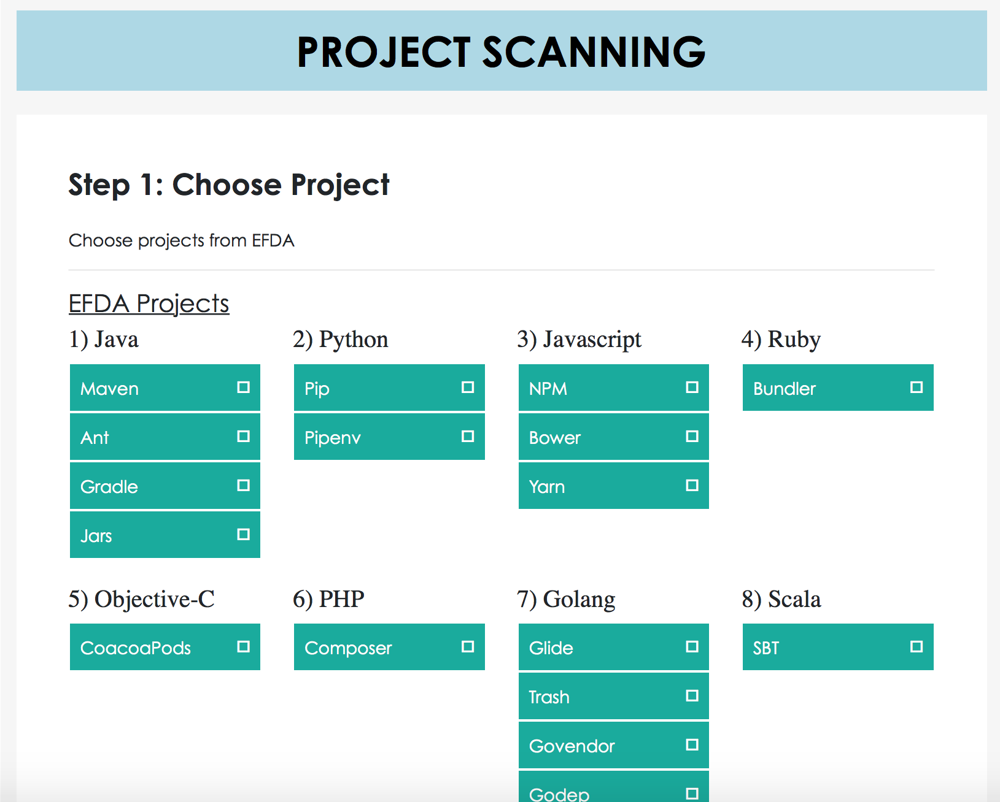
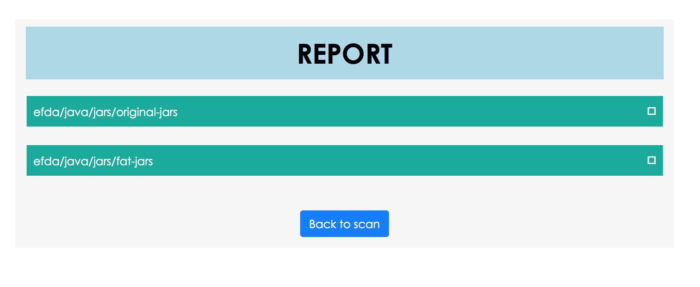
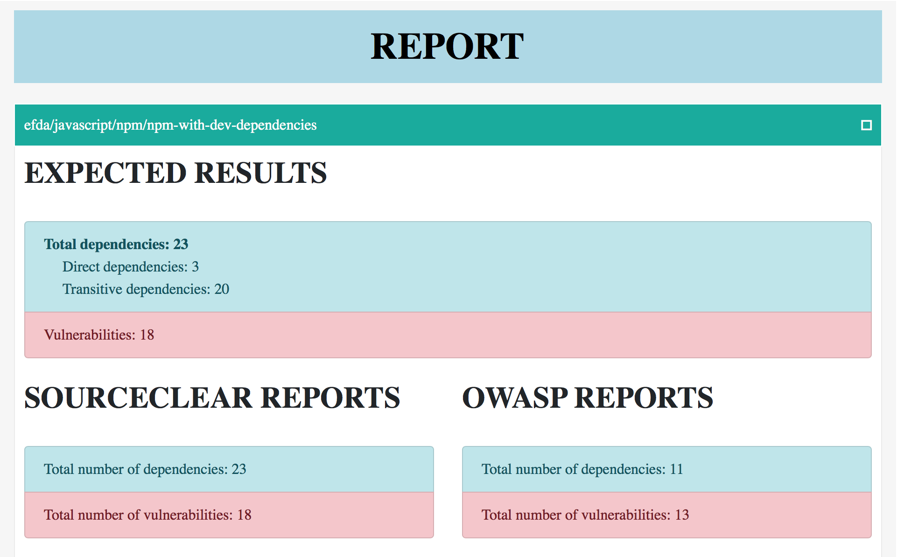

# efda-webscanner

This is the web UI for scanning https://github.com/srcclr/efda.

## Installation and Usage

Clone the repository from GitHub.

```
$ git clone --recursive https://github.com/srcclr/efda-webscanner.git
```

Build the UI with `npm`.

```
$ cd ui/
$ npm install
$ npm run build
```

The efda-webscanner application is deployed in a Docker container.

The `build.sh` script can be used to build the Docker container image. The
built image is tagged as `efda`.

```
$ ./build.sh
```

Before launching the container, you will need to export your SourceClear agent
token as an environmental variable.

```
$ export SRCCLR_API_TOKEN=<TOKEN>
```

Once you do that, the container can be launched with the `run.sh` script. The
web application will be listening on port 5000.

```
$ ./run.sh
```

## Screenshots

This is the initial page you will see when visiting the web application:



After the scan is done, you will see a list of results for each EFDA project
scanned:



Clicking on each project tab reveals the dependency and vulnerability
information:


